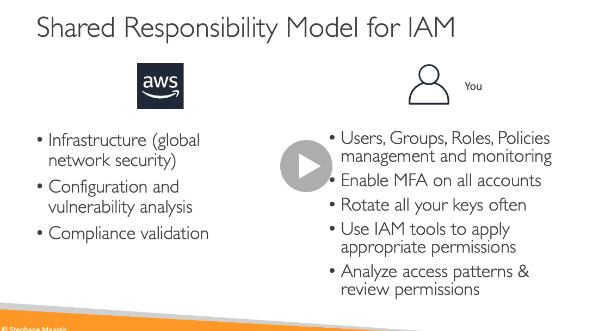
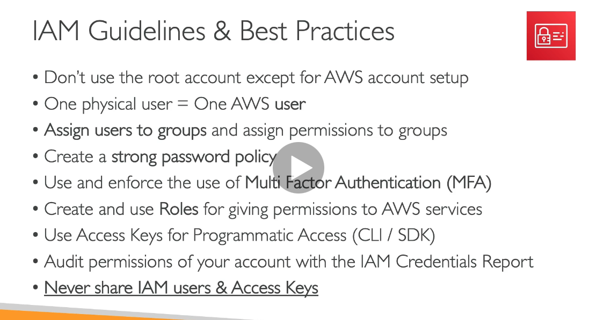
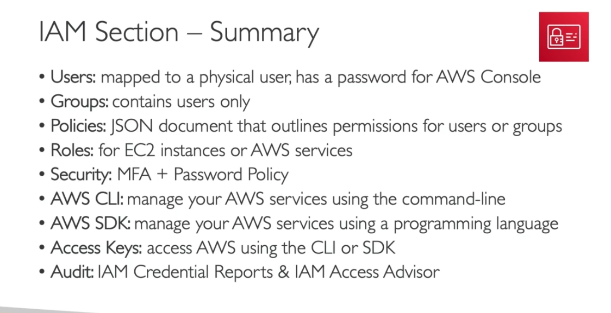

# AWS cloud practitioner course

## Cloud computing

- [Types of Cloud computing ('as' services)](https://thoughtworks.udemy.com/course/aws-certified-cloud-practitioner-new/learn/lecture/20263106#overview)

  - 

  - 

- [Shared Responsibility Model](https://aws.amazon.com/compliance/shared-responsibility-model/) in AWS

  - 

- Concepts of Regions and zones

  - Availability zones
    - 
  - Regions (US-east-1, US-east-2 etc.,)
    - Regions comprises of 2 - 6 availability zones
  - Points of Presence

- How to chose a Region

  - 

- AWS pricing depends on

  - compute
  - Storage
  - Data transfer out of the AWS cloud

- Most services in AWS are region specific

## IAM policy

- Policy structure

  - 

- Password policy

  - 

- Multi factor Authentication

  - 
  - 
  - 

- Shared Responsibility

  - 

- IAM guidelines
  - 
- IAM summary
  - 
